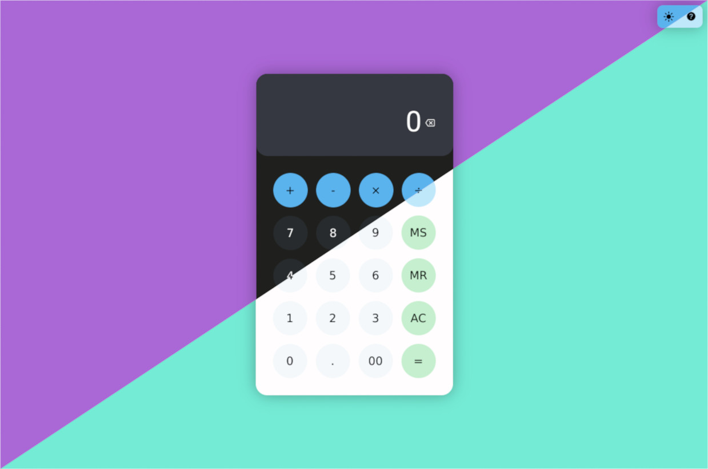

	<h1>Calculadora Web</h1>

	

	

		Calculadora implementada usando HTML, CSS e JS, feita com base no workshop promovido pela Beets Jr.
		 
		Vídeo do workshop: <a href="https://www.youtube.com/live/MajCTloQHr4?si=sOzjHsQ0QUrqYst9" rel="nofollow" target="_blank">Workshup Beets Jr - Dia 1</a>
	

<h2>Problemas conhecidos</h2>

<ul>
	<li>Teclar duas vezes no botão <em>igual</em> não repete a operação;</li>
	<li>Botão de ajuda ainda não está completo.</li>
</ul>
